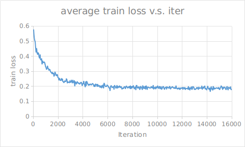
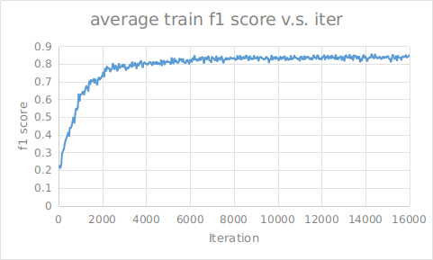
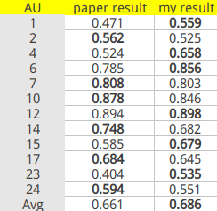

# ROI-Nets pytorch version
## Pytorch implementation of [Action Unit Detection with Region Adaptation, Multi-labeling Learning and Optimal Temporal Fusing](https://arxiv.org/abs/1704.03067)
## How to use:
- clone codes
- download vgg pretrained parameters [vgg16](https://download.pytorch.org/models/vgg16-397923af.pth) in `data` directory
- prepare labels for every images, the format is shown in `data/labels_224_landmarks_sample.txt`
- modify parameters in `lib/train_test.py`, like `image_dir`. `save_dir`,`person_batch`
- run code: `cd lib; CUDA_VISIBLE_DEVICES=1 python train_test.py`
## Result:
1. train loss  

2. train f1  

3. result  

### Reference: https://github.com/AlexHex7/DRML_pytorch and https://github.com/wiibrew/EAC-Net